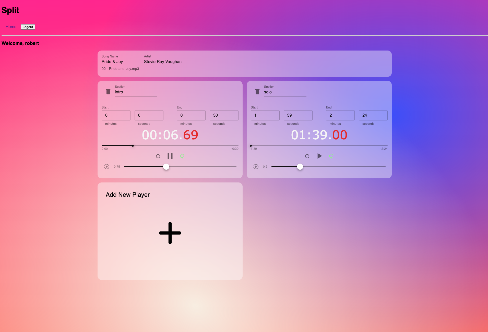

# Split 

## Description

A Web application for musicians that practice a piece of a song over and over again and want to quickly and easily switch between sections without losing the position in the song.

## Migration

This repo served as the Proof of Concept for what has now become the [Practice Makes Performer App](https://github.com/robertdavidwest/practice-makes-performer) with an improved tech stack and additional features.
